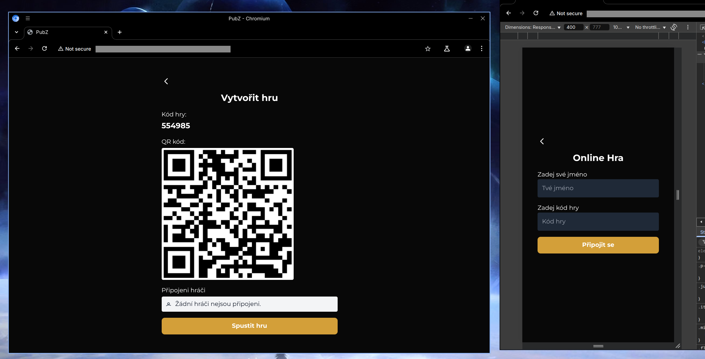

### 
!! Educational Archive !!

# 
Project Week - PubZ

#### 
Long ago, two races ruled over Earth... oh sorry, wrong story...

#### The Story

This is PubZ - my school assignment that was supposed to test our collaboration with colleagues from other fields in a one-week project.

Our assignment was to create a pub quiz about generation z and host it online so our school could use it for self-promotion (we didn’t allow that). We could use any technology as long as it’s web. So since both I and my colleague hate web development, we decided to go with the most simple setup we could possibly think of:
- Raw PHP
- MySQL (MariaDB)
- Infinity Free Web Hosting (well, not actually, explained later)
- GitHub

We remembered that most projects from previous years failed in deploying on the server - they developed locally and when they moved it to the server (on Friday, of course) they found out that nothing worked. So we decided that we would develop right on the deployment server with a GitHub action that uploaded the whole repo via FTP to that Infinity Free server after every push. That was an excellent strategy and worked amazingly - we were only 2 working on backend and frontend was developing locally so we had no issues whatsoever.

The issue came on Friday at 4 in the morning when I pushed literally the last commit to the project (we wanted to complete the whole project on Wednesday so we would have the whole Thursday for fixing minor bugs and Friday completely free for troubleshooting if something went wrong). I pushed that little change to that error message for player disconnection and just to be sure I opened it to test that it works... and instead of seeing our ugly website I saw a message saying that our ACCOUNT WAS SUSPENDED...

It turns out that even though Infinity Free doesn’t limit the bandwidth of free websites, they limit the requests made to the server... and they don’t say that in any step in creating a domain. To be fair, that limit is 50,000 a day which is more than enough for a small or even mid-sized website... but do you remember what I said about our brilliant development workflow...

I tried creating a new domain but that didn’t work. I tried creating a new account and that worked except for some reason I could not create any domain. So then I tried using my other colleagues' server he didn’t use since they failed to successfully move their project here... didn’t work. So in the end (at 5:50 in the morning, 20 mins before I headed to the school) I assembled the most janky solution I could:
- My Android phone with a cellular connection (my school wifi is more broken than me and that's something to say)
- Termux opened and a cloudflare tunnel on it.
- Apache server as a proxy to my laptop connected to a hotspot.
- My laptop running built-in PHP server and MariaDB

Still to this day I haven't figured out why I could not just create a tunnel directly to my laptop - it just refused to connect to the cloudflare servers. I don’t have a VPN or anything. On my home network it worked without any issue.

Also It doesn't work on Firefox anymore which is funny since we all used firefox for developint it 	¯\\\_( ͡° ͜ʖ ͡°)\_/¯.

Nonetheless this worked surprisingly well (after like 4 hours and single-player mode not working anymore). But in the end... I survived == I’m happy.

#### The Code
Yep, I'm too tired to write this now. 
TODO: write this one day ... ... ... 
Ok, I'll write something.

The code is really bad, don't use it, please. It was supposed to be written entirely in PHP and using a PHP session with javascript just pulling data from the server. But since the incident with the hosting most parts were rewritten in javascript and without any security whatsoever. It has quite a good base. But the rest is a disaster.

Also almost the entire frontend was written using AI since those guys don't know anything about programming (I don't mind, my school does a pretty bad job at teaching it). The backend on the other hand is completely AI free because:
1. Formal one: It would take too long to explain what we want it to do and it would overengineered as hell.
2. Real one: Programming with AI is REALLY frustrating. I hate programming with AI.

#### Be aware of the following:
1.  This was purely an **educational exercise**. The code served to meet academic requirements and demonstrate understanding of specific topics at the time.
2.  The Git history hasn't been **rebased**, and includes commit messages that could be offensive.
3.  Key components required for execution. The project in this repository is **non-functional** and provided "as-is". It cannot be run without significant effort to replace the missing parts and potentially adapt it to different environments.

#### License:
PubZ is released under the Unlicence licence. Check the `LICENSE` file for the full details.

Also, if you didn’t get that joke at the start of this readme, don’t worry, it’s a really stupid joke.

